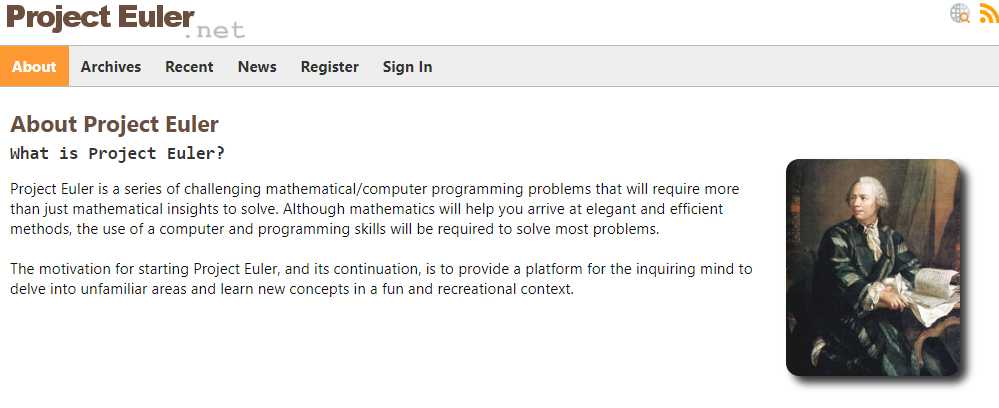

# Python 언어 및 코드 연습

*학습기간 : * 2022. 01. 18. ~ 2022. 06. 16.

## Project Euler

  

프로젝트 오일러
수학적 접근법과 프로그래밍적 접근법을 같이 연습

* 수학적인 지식과 프로그래밍 실력 모두 요구
* 수학적 지식으로 알고리즘을 구축하고 프로그래밍 기법으로 실행
 

## Maze

  

  *미로찾기 플레이 화면*

  

  *미로찾기 디버그 모드*

파이썬 코드로 미로찾기 게임 구현입니다.
아래와 같은 내용을 중요하게 생각하면서 구현했습니다.

* 기능 단위의 모듈화
* 의미가 반영된 변수 Clean Code
* 세팅 및 변수 파라미터 관리가 용이한 모듈화

## Path findfing Algorithm

* A star
  * code review
  * path finding (maze) 구현
* dijikstra
  * code review
